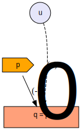

#< ignore
```{r setup, include=FALSE}
knitr::opts_chunk$set(echo = TRUE, error=TRUE)
```
#>

#. include slide_defaults.rmd

#< settings
libs: ggplot2
slides: FALSE
toc.levels: [section,frame]
number.levels: [section, frame]
#>


#< css
@media print {
  .slide-container-div {
    page-break-inside: auto;
  }
}

.border-table td {
  border: 1px solid grey;
  padding-right: 4px;
  padding-left: 4px;
}

#>


#. frame
<center>
<h2> Thoughts on Causality, Endogeniety and Instrumental Variable Estimation </h2>

<h3> Sebastian Kranz </h3>
<h3> Uni Ulm</h3>
</center>

#### Contents
#. toc

#. section Estimating A Demand Function

#. frame Estimating A Demand Function

+ As leading example, we consider the task of estimating a demand function using past observations of prices and quantities (and costs).

+ To simplify thinks, we assume the observed data has been generated by a simple true data generating proceess.

#. frame DGP: Demand Function

+ In period $t$ we have a simple linear demand function of the form:

  $$D_t(p) = a_t - b p$$

  with an intercept $a_t$ given by
  
  $$a_t = a_0 + u_t$$
  
+ The slope $b$ and $a_0$ are some fixed numbers which are the same for all periods.

+ $u_t$ is a i.i.d. normaly distributed random variable with mean 0. We call $u_t$ a demand shock, since it shifts the demand function up or down.

#. frame DGP: Price Setting

+ Assume the observed prices $p_t$ has been set by a clever decision maker who knew, $b$, $a_0$ and the demand shock $u_t$ and wanted to maximize the following static profit function:

  $$
  \begin{align*}
  \pi =& D_t(p_t)(p_t-c_t) \\
     =& (a_0 - b p + u_t)(p_t-c_t)
  \end{align*}
  $$

  + $c_t$ shall be the constant variable cost of the product that can change between periods.
  
+ Solving the first order condition $\pi'(p_t) = 0$ yields the following price in period $t$:

  $$p_t = \frac{a_0+u_t}{2*b} + \frac{c_t}{2}$$
  
  and a resulting output $q_t = D_t(p_t)$ of

  $$q_t = \frac{a_0+u_t}{2} - b \frac{c_t}{2}$$

#. frame DGP: Simulation

+ If we specify some concrete numbers for $a_0$, $b$, the standard deviation of $u$ and a distribution of costs $c_t$, we can write a short R program that simulates data from this DGP.

```{r precompute=TRUE, preknit=TRUE}
set.seed(123456)
a0 = 100 # average intercept of demand function
b = 1 # -b is the slope of the demand function
T = 200 # number of observations
sigma.u = 5 # standard deviation of demand shock

# Draw T demand shocks
u = rnorm(T,0,sigma.u)

# Draw random costs
c = runif(T, 10, 15)

# Profit maximizing price
p = (a0+u) / (2*b) + c / 2

# Demand at p
q = (a0+u) - b * p

# Combine data into a data frame
dat = data.frame(t=1:T,p=p,q=q,c=c)

# Show first 3 rows
head(dat,3)
```
```{r}
.whiskers = nlist(a0,b,T)
```


#. frame Plot of the simulated data
Here is a plot of the prices vs sold quantity:
```{r preknit=TRUE}
library(ggplot2)
ggplot(dat, aes(x=p, y=q)) + 
  geom_point()+
  geom_smooth(method=lm, se=FALSE)
```

#. frame A simple OLS regression
+ The blue line shows the fitted values from a simple linear regression of $q$ on $p$
+ Recall that the average intercept of the demand function is $a_0 = {{a_0}}$ and the slope is $-b = {{-b}}$.
+ An OLS regression of $q$ on $p$ yields estimated coefficients that are completely different:
```{r preknit=TRUE}
summary(lm(q~p))
```
+ As you can see from the small standard errors, this difference is **not** due to a small sample estimation error. Even if the number of observations $T$ grows large, the estimated coefficients of the regression line won't converge towards the intercept and slope of the demand function.

#. frame Best Linear Predictor and OLS

+ Given a dependent random variable $y$ and random or deterministic explanatory variables $x=(x_1,...,x_K)$, the predicted value $\hat{y}(\beta | x)$ for a linear predictor $\beta = (\beta0, \beta_1,...,\beta_K)$ is defined by
$$\hat{y}(\beta | x) = \beta_0 + \beta_1 x_1 + ... + \beta_K x_K$$

+ The best linear predictor minimizes the expected squared differences between $y$ and the predicted value $\hat{y}(\beta | x)$, i.e.

  $$\beta^{BLP} = \arg \min_{\beta} E (y-\hat{y}(\beta | x))^2 $$

  + The expectation is taken over the joint distribution of $y$ and all $x$.

+ The OLS estimator is simply defined as the sample analogue to the best linear predictor:

 $$\hat{\beta} = \arg \min_{\beta} \sum_{t=1}^T {(y_t-\hat{y}(\beta | x_t))^2}   $$
  where here $x_t$ denotes the vector of explanatory variables in period $t$.

+ Under fairly weak conditions, the OLS estimator $\hat{\beta}$ converges in probability to the best linear predictor $\beta^{BLP}$.

#. frame Best Linear Predictor and Error Term

+ The relationship between random variables $y$ and $x_1,...x_K$ can always be written in the following form:

  $$y = \beta_0^{BLP} + \beta_1^{BLP} x_1 + ... + \beta_K^{BLP} x_K + \eta$$

  such that the error term 
  $$\eta = y - \hat{y}(\beta | x)$$
    + has mean 0: $E(\eta) = 0$ and
    + is not correlated with any explanatory variable $cor(\eta, x_k) = 0$ for all $k=1,...,K$.

+ This result always holds, even if the "true" relationship between $y$ and the $x$ has a much more complicated, non-linear form.     

#< assumption
  - The explanatory variables $x_1,...,x_K$ are linearly independent.
  - All first and second moments converge (the law of large number applies). 
#>

#< conjecture
Given a dependent random variable $y$ and K explanatory variables $x_1,...,x_K$, there is a unique linear predictor $\beta^{BLP}$.
#>

#< conjecture
Consider the following relationship between $y$ and $x_1,...,x_K$
  $$y = \beta_0 + \beta_1 x_1 + ... + \beta_K x_K + \eta$$
The following two statements are equivalent:
  a) $\beta=\beta^{BLP}$ ($\beta$ are the coefficients of the best linear predictor)
  b) $\eta$ has mean 0 and is uncorrelated with every explanatory variable $x_k$.
  
Then $\beta$ is the best linear predictor of y given $x_1,...,x_K$ if and only if

- first
- second
- third
#>

#< proof
Ommited.
#>

#. frame Remark: OLS Residuals

+ A similar result holds for the OLS residuals.
+ Let $\hat{\beta}$ be the OLS estimates and $\hat{\eta}$ the residuals:

  $$y = \hat{\beta_0} + \hat{\beta_1} x_1 + ... + \hat{\beta_K} x_K + \hat{\eta}$$

  The OLS residuals $\hat{\eta}$
    + have mean 0: $\sum_{t=1}^T{\hat{\eta}} = 0$ and
    + are not correlated with any explanatory variable $\cor(\hat{\eta}, x_k) = 0$$ for all $k=1,...,K$.

#. frame Best linear predictors in our example

+ Recall the OLS regression of output on prices in our example:
```{r preknit=TRUE}
coef(lm(q~p, data=dat))
```
+ The estimated coefficients are fairly close to the best linear predictors $\beta^{BLP}$ of this regression model.
+ Recall the formula for equilibrium prices and output:
  $$p_t = \frac{a_0+u_t}{2*b} + \frac{c_t}{2}$$
  $$q_t = \frac{a_0+u_t}{2} - b \frac{c_t}{2}$$

+ The positive relationship between $p$ and $q$ arises from the fact that positive demand shocks $u_t$ cause both the demand and prices to increase. Even though - ceteris paribus-, i.e. holding $u$ fixed, demand decreases in the price $p$, this common positive influence outweights this negative effect in our numerical example.

#. frame Causal Effects

+ In economics, we often want to estimate the *causal* effect that a change in an explanatory variable has on the dependent variable.

+ In economics, the notion of a causal effect is typically based on a thought experiment, in which we change an explanatory variable, while keeping all other factors that influence the dependent variable constant. This is also called ceteris-paribus analysis.

#. frame Causal effect vs linear predictor in demand function example

+ In our example, we are interested in estimating the coefficients of the demand function:
  $$q = \beta_0 + \beta_1 p + u$$

+ In this linear demand function, $\beta_1$ measures the causal effect of the price on demand. This means $\beta_1$ measures by how much the demand changes, when the price changes by 1 unit and we keep the the demand shock $u$ fixed. 

+ Here the coefficient for the causal effect $\beta_1$ (in our example -1) is quite different from the best linear predictor $\beta_1^{BLP}$ (in our example around 0.88). 

For an illustration consider the following two diagrams

#< figure
<table style="width=100%"><tr><td>
<center>DGP</center>
#. include demand_dgp.svg
</td><td>
<center>Causal Effect</center>
#. include demand_causal.svg
</td></tr></table>
##. caption
Figure: (left) True data generating process. Demand shock u influences price p. (right) Causal effect based on an intervention that exogenously changes price p, while keeping demand shock u fixed.
#>

In our data generating process

```{r}
lm(u~p)

cov(p,u) / var(p)

```


#. frame BLP in our example


#< figure [2col]
##. left

##. right

##. caption
True data generating process (left). Causal effect based on an intervention that exogenously changes price (right).
#>


```{r, preknit=TRUE, precompute=TRUE}
sim.data = function(T=200, a0=100, b=1, sigma.u=5, cmin=10, cmax=15) {
  # Draw T demand shocks
  u = rnorm(T,0,sigma.u)
  
  # Draw random costs
  c = runif(T, cmin, cmax)
  
  # Profit maximizing price
  p = (a0+u) / (2*b) + c / 2
  
  # Demand at p
  q = (a0+u) - b * p
  
  # Combine data into a data frame
  dat = data.frame(t=1:T,p=p,q=q,c=c, u=u)
  dat
}
dat = sim.data(T=10000)
summary(lm(q~p, data=dat))
```

#. section Non-Linearities

#. frame Linearized Causal Effects


```{r}
T = 1000
sigma.u = 0.1
u = rnorm(T,0,sigma.u)
xnorm = function(x, factor=5) {x * factor*sd(u) / sd(x)}
y.fun = function(x) ifelse(x > 1, 1, x) + u

x.min = 5; x.max = 20

x.vals = c(x.min,x.max)

x.r1 = xnorm(runif(T,0,2))
x.r2 = xnorm(sample(x.vals,T,replace=TRUE))

x.e1 = xnorm(x.r1 - 5*u)
x.e2 = xnorm(x.r2 - u)


# for x<1 slope = 1, else slope = 0
y.r1 = y.fun(x.r1)
y.r2 = y.fun(x.r2)
y.e1 = y.fun(x.e1)
y.e2 = y.fun(x.e2)


plot(x.r1,y.r1, xlim=range(c(x.r1,x.e1)),ylim=range(c(y.r1,y.e1)))
points(x.e1,y.e1, col="red")

lm(y.e1 ~ x.e1)
cor(x.e1, u)
cor(y.e1, u)

```

```{r}
T = 1000 # number of observations
beta0 = 0 # average intercept of demand function
beta1 = -1 # -b is the slope of the demand function
sigma.u = 5 # standard deviation of demand shock

# Draw T demand shocks
u = rnorm(T,0,sigma.u)

# Draw random costs
c = runif(T, 10, 15)

# Profit maximizing price
p = (a0+u) / (2*b) + c / 2

# Endogenous price
p = (u +runif(T,-1,1)) / 2
# random price
#p = (runif(T,-1,1)) / 2


# Demand at p
q = beta0 + beta1 * p + u
q = beta0 + ifelse(p>0,0,beta1 * p) + u


plot(p,q)

```


#. frame Non-Linearities
```{r}
T = 10000
a0 = 100 # average intercept of demand function
b = 1 # -b is the slope of the demand function
sigma.u = 4 # standard deviation of demand shock

# Draw T demand shocks
u = round(rnorm(T,0,sigma.u),2)

# Draw random costs
c = runif(T, 10, 25)
c2 = c^2

# Endogenous price
p = (a0+u) / (2*b) + c / 2

#p = c * runif(T,1,1.1)
p2 = p^2

# Demand at p
q = (a0+u) -  p - 0.1*p2
beta.p = c(-1,-0.1)


summary(ols <- lm(q~p+p2))
library(AER)
summary(iv <- ivreg(q~p+p2 | c+c2))

mfx = function(p, beta) {
  beta[1] + 2*beta[2]*p
}
p.seq = seq(min(p),max(p), length=101)
mfx.true = mfx(p.seq,beta.p )
mfx.iv = mfx(p.seq, coef(iv)[2:3])
mfx.ols = mfx(p.seq, coef(ols)[2:3])

plot(p.seq, mfx.true, type="l", ylim=range(c(mfx.true,mfx.ols,mfx.iv)))
lines(p.seq, mfx.iv, col="red")
lines(p.seq, mfx.ols, col="blue")

```


#. frame Two endogenous variables

```{r}
T = 100000
sigma.u = 2
u = rnorm(T,0,sigma.u)

xnorm = function(x, factor=4) {x * factor*sd(u) / sd(x)}
z1 = rnorm(T,0,1)
z2 = rnorm(T,0,1)+0.1*z1
x1 = rnorm(T,0,2)+z1+0.1*z2+u
x2 = rnorm(T,0,2)-0.5*z1-z2+0.1*x1+2*u
cor(x1,x2)

y = 0 + x1 + x2 + u
# biassed OLS
lm(y~x1+x2)

# first stage
summary(reg11 <- lm(x1~z1+z2))
summary(reg12 <- lm(x2~z1+z2))

eta1 = resid(reg11)
eta2 = resid(reg12)
x1.hat = fitted(reg11)
x2.hat = fitted(reg12)
cor(eta1, eta2)
cor(x1.hat, x2.hat)
cor(x1.hat, eta1)
cor(x1.hat, eta2) # = 0 why?
cor(x2.hat, eta1)
cor(x2.hat, eta2) # = 0 why?

# Another simulation
x1 = rnorm(T)
x2 = -0.5*x1 + rnorm(T)
u1 = rnorm(T)
u2 = rnorm(T) + 10*u1

y1 = x1 + x2 + u1
y2 = -0.5*x1 + 2*x2 + u2
cor(y1,y2)

summary(reg11 <- lm(y1~x1+x2))
summary(reg12 <- lm(y2~x1+x2))

eta1 = resid(reg11)
eta2 = resid(reg12)


y1.hat = fitted(reg11)
y2.hat = fitted(reg12)
cor(eta1, eta2)
cor(y1.hat, y2.hat)
cor(y1.hat, eta1)
cor(y1.hat, eta2) # = 0 why?
cor(y2.hat, eta1)
cor(y2.hat, eta2) # = 0 why?

```

#. section Notes on OLS


```{r}
T = 100
x1 = runif(T,0,50)
x2 = x1 + runif(T,0,50)
# demean
xd1 = x1 - mean(x1)
xd2 = x2 - mean(x2)
Xd = cbind(xd1,xd2)

# Variance covariance matrix
cov(Xd)
t(Xd)%*%Xd / (T-1)

icov = solve(cov(Xd))
icov %*% cov(Xd)

cov(Xd %*% icov)
cov(Xd / sqrt(diag(cov(Xd))[1]))
cov(Xd / diag(cov(Xd))[1])

mat = t(sapply(seq.int(T), function(t) icov %*% Xd[t,]))
cor(mat[,1],mat[,2])
cov(mat)

cov(Xdc)
cor(Xdc[,1],Xdc[,2])

```

#. section
