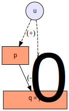

#< ignore
```{r setup, include=FALSE}
knitr::opts_chunk$set(echo = TRUE, error=TRUE)
```
#>

#. include slide_defaults.rmd

#< settings
libs: ggplot2
slides: TRUE
toc.levels: [section,frame]
number.levels: [section, frame]
chunk.preknit: TRUE
chunk.precomp: TRUE
#>


#< css
@media print {
  .slide-container-div {
    page-break-inside: auto;
  }
}

.border-table td {
  border: 1px solid grey;
  padding-right: 4px;
  padding-left: 4px;
}

#>


#. frame
<center>
<h2> Thoughts on Causality, Endogeniety and Instrumental Variable Estimation </h2>

<h3> Sebastian Kranz </h3>
<h3> Uni Ulm</h3>
</center>

#### Contents
#. toc

#. section OLS as Best Linear Predictor

#. frame

### A data generating process

Here is an example data set with $T=5$ observations for 3 variables $y$,$x_1$ and $x_2$:
```
         y        x1         x2
1 1.599118 1.8471405 -0.3724507
2 3.132896 0.6320767  1.5245515
3 3.099633 1.0589757  1.2033221
4 4.998145 1.3760521  2.4493260
5 1.760605 1.6576430 -0.2166071
```

Most of statistics and econometrics is based on the idea that a data set is a realization of an underlying stochastic process that represents how reality generates the data. That stochastic process is commonly called the *data generating process (DGP)*. We assume that we can draw any integer number T of observations from the data generating process.


### Simulation: An R function as data generating process

Simulation is a very helpful tool to strengthen an intuitive understanding of econometrics. So instead of taking some data from the real world, consider a data generating process given by the following R function:
```{r}
dgp = function(T) {
  # some autocorrelated unobserved variable
  u <- as.vector(arima.sim(n=T, list(ar = 0.75)))
  # x1 depends on u and some random shock
  x1 = runif(T,0,2) + 0.5*u
  # x2 depends on x1 and u and randomness
  x2 = runif(T,-1,1)-x1 + u^2
  # y is a non-linear function of x1 and
  # depends on x2 and u
  y = x1 -0.3*x1^2 +0.01*x1^3 + x2 + u
  # return observed data
  data.frame(y,x1,x2)
}
```
Note that this DGP looks on purpose considerably more complicated than the typical linear regression model initially discussed in most econometrics text books. On the other hand, most real world data generating processes are probably much more complicated than this little R function.

We can repeatedly call our function to simulate data sets of different sizes T from the DGP:
```{r}
dgp(T=2)
dgp(T=3)
```

## Linear regression equation

Consider any , possibly very complicated, DGP that generates observations for $K \geq 2$ random variables.

We can **always** write the relationship between the random variables in the following *linear regression* form:

$$y_t = \beta0 + \beta_1 x_{1,t} + ... + \beta_{K-1} x_{K-1,t} + \varepsilon_t \forall t=1,...T \tag{1}$$

In the terminology of the linear regression model we call:

  - $y=(y_1,...,y_T)'$ the *dependent variable*
  - $x_k=(x_{k,1},...,x_{k,T})$ an *explanatory variable* or independent variable
  - $beta_k$ a *coefficient* and $beta$ the vector of coeffiecients.
  - $\eps=(\eps_1,...\eps_T)$ the *error term* or *disturbance*

Looking at the linear regression equation one may be tempted to interpret a lot of structure: namely that we essentially have a linear relationship between the random variables that is a bit noisy due to the error term $\eps$.

Yet, simply by defining the error term as

$$\eps_t = y_t - \beta0 + \beta_1 x_{1,t} + ... + \beta_{K-1} x_{K-1,t}$$ 

the linear regression equation holds always true by defintion, no matter how complicated the relationship between the random variables.

The linear regression *model* in econometric textbooks gets its substance by imposing several assumptions on these random variables. We will explore these assumption step by step below.

### Linear regression equation in matrix notation 
Often it is convenient to use matrix notation in linear regression models.

Let $$X=(1 : x_1 : ... : x_{K-1})$$ be the TxK matrix of explanatory variables. The first column only consists of ones. We can define $$x_0=1$$. Each subsequent column corresponds to one explanatory variable $$x_k$$. 

Then the linear regression equation can be compactly written as
$$y = X\beta+\varepsilon$$.

#< info Random Variables vs Realizations
Note that we don't distinguish in the notation between a random variable and its realization. So $x_{1t}$ could refer to the random variable $x_{1t}$ of the stochastic process or to a particular realization. Many relationships denoted below will hold for both random variables and realizations. When not, it should be clear from the context whether we mean a random variable or its realization.
#>

### The ordinary least square estimates

Assume we have drawn a data set $(y,X)$ with $T$ observations from the DGP. Let $\hat{\beta}$ be a vector of coefficents.
Let us call 
$$\hat{y}= X\hat{\beta}$$
the *fitted values* (or predicted values) given $\hat{\beta}$ and
$$\hat{\varepsilon} = y - \hat{y}$$
the corresponding *residuals*.

The ordinary least squares estimate is defined as that coefficient vector $\hat{\beta}^{OLS}$ that minimizes the sum of squared residuals:

$$\hat{\beta}^{OLS} = \arg\min_{\hat{\beta}} \sum_{t=1}^T \hat{\varepsilon}(\hat{\beta})^2$$

The OLS estimate $\hat{\beta}^{OLS}$ is uniquely defined if and only if the following full rank condition is satisfied.

#< condition Full Column Rank
The matrix of explanatory variables $X$ has a rank of K (full column rank). This means all explanatory variables are linearly independent.
#>

#< proposition
If X has full column rank, the OLS estimate is uniquely given by the following formula:
$$\hat{\beta}^{OLS} = (X'X)^{-1}X'y$$
#>
#< note Proof
We can write the residual sum of squares as

\[
\begin{eqnarray*}
S & = & \sum_{t=1}^{T}\hat{\varepsilon}_{t}^{2}\\
 & = & \hat{\varepsilon'}\hat{\varepsilon}\\
 & = & (y-X\hat{\beta})'(y-X\hat{\beta})
\end{eqnarray*}
\]

The first order condition for a minimum is given by
\[
\begin{eqnarray*}
\frac{\partial S}{\partial\hat{\beta}} & = & 2X'(y-X\hat{\beta})=0
\end{eqnarray*}
\]
This can be rewritten as
\[
\begin{eqnarray*}
X'X\hat{\beta} & = & X'y\\
\hat{\beta} & = & (X'X)^{-1}y
\end{eqnarray*}
\]
#>

The following result provides a nice intuition for the OLS estimator.

#< proposition
The OLS estimate is the unique coefficient vector $\hat{\beta}$ for which the residuals $\hat{\varepsilon}$ satisfy the following conditions:

1. The average value of the residuals is zero: $$\sum_{t=1}^{T}\hat{\varepsilon}_{t}=0$$.

2. The residuals are uncorrelated (sample correlation is zero) with all explanatory variables:
$$cor(x_{k},\hat{\varepsilon})=0\forall k=1,...K-1$$

Also note that that 1. and 2. are equivalent to the condition:
$$x_{k}^{'}\hat{\varepsilon}=0 \forall k=0,...K-1$$

#>
#< note Proof
We don't completely proof the Proposition but only show that for the OLS estimate 1. and 2. are satisfied.

The first order condition for minimizing the sum of squares was given by

\[
\begin{eqnarray*}
X'(y-X\hat{\beta})=0
\end{eqnarray*}
\]

We have
\[
y=X\hat{\beta}+\hat{\varepsilon}
\]
Plugging this into the first order condition yields:

\[
\begin{eqnarray*}
X'(X\hat{\beta}+\hat{\varepsilon}-X\hat{\beta}) & = & 0\\
X'\hat{\varepsilon} & = & 0
\end{eqnarray*}
\]

To understand this condition better let us, write it in more detail for the case of two explanatory variables:

\[
\left(\begin{array}{ccc}
1 & ... & 1\\
x_{11} & ... & x_{1T}\\
x_{21} & ... & x_{2T}
\end{array}\right)\left(\begin{array}{c}
\hat{\varepsilon}_{1}\\
\hat{\varepsilon}_{2}\\
...\\
\hat{\varepsilon}_{T}
\end{array}\right)=0
\]

Multipling the first row of $X$ (just a row of ones) with $\hat{\eps}$ yields
$$\sum_{t=1}^{T}\hat{\varepsilon}_{t}=0$$

Multiplying the $k+1$'th row with $\hat{\eps}$ yields the condition
\[
x_{k}^{'}\hat{\varepsilon}=\sum_{t=1}^{T}x_{kt}\hat{\varepsilon}_{t}=0
\]

The correlation between two random variables $x$ and $y$ can be written as 
$$cor(x,y)=Exy-ExEy$$
For the sample correlation, we simply replace the expectations with the average values in the sample.
Hence, we have
\[
\begin{eqnarray*}
cor(x_{k},\hat{\varepsilon}_{t}) & = & \frac{1}{T}\sum_{t=1}^{T}x_{kt}\hat{\varepsilon}_{t}-\left(\frac{1}{T}\sum_{t=1}^{T}x_{kt}\right)\left(\frac{1}{T}\sum_{t=1}^{T}\hat{\varepsilon}_{t}\right)\\
 & = & \frac{1}{T}\cdot0-\left(\frac{1}{T}\sum_{t=1}^{T}x_{kt}\right)\left(\frac{1}{T}\cdot0\right)\\
 & = & 0
\end{eqnarray*}
\]
#>

Hence you can think of the OLS estimate as that coefficient vector that for the realized data set makes all explanatory variables uncorrelated with the residuals and gives the residuals a zero mean. 

### Coding Example: Implementing the OLS estimate in R

Here is a manual implementation of the OLS estimate in R:
```{r}
ols = function(y,X) {
  as.vector(solve(t(X)%*%X)%*%t(X)%*%y)
}
```

We can now draw some data and compute the OLS estimate:
```{r}
# draw data from the dgp
dat = dgp(100)
# create X matrix
X = cbind(1,dat$x1,dat$x2)
# compute the OLS estimate
ols(dat$y,X)
```

## Illustration: Convergence of the OLS estimator

The following function draws data from the DGP and computes the OLS estimates for a given sample sizes T:
```{r}
sim.and.est = function(T) {
  dat = dgp(T)
  X = cbind(1,dat$x1,dat$x2)
  ols(dat$y,X)
}
sim.and.est(100)
sim.and.est(100)
```
The OLS estimate depends on the relalized data set and is therefore itself a random variable that differs between calls.

The following code repeats the call to sim.and.est 1000 times each for three different values of T. The function simulation.study conveniently stores the results in a data.frame.
```{r}
library(sktools)
library(R.cache)
sim = cachedEval(simulation.study(sim.and.est,par = list(T=c(10,50,500)),repl = 10000, colnames=c("beta0.hat","beta1.hat","beta2.hat"), add.run.id=FALSE))
head(sim,3)
```
The following code shows the corresponding histograms of the simulated beta1.hat for the three different values of T:
```{r}
library(ggplot2)
qplot(x=beta1.hat, geom="histogram", facets = ~T, data=sim, fill=as.factor(T))
```
It looks as if for larger sample size, the OLS estimate $\beta_1$ converges (in probability) against some number a bit above 1.5. 


## Best Linear Predictor: Population equivalent of OLS estimator

Recall that we can write down a linear regression equation and compute an OLS estimate without really imposing assumptions on the DGP.

In this section, we introduce some assumptions on the DGP that guarantee that the OLS estimator converges (in probability) agains a specific vector of coefficients $\beta^{BLP}$. BLP stands for 'Best Linear Predictor' and will be explained below.

Notably, for such convergence, we need much fewer assumptions than those which are commonly imposed on the linear regression model. 

Don't worry if you don't really understand any technical details of these assumptions. Formalizing assumptions and deriving results for a stochastic process is just more technical than the corresponding parts for the OLS estimate for a given data set. The content of the crucial results will be quite analogous, however.

The following assumption guarantees that a law of large numbers applies to the DGP:
#< assumption
The DGP is an ergodic stationary stochastic process.
#>

Below are some intuitive explanations, what ergodic stationarity means, but you can also skip these explanations.

Stationarity implies that the distibution of a (possibly vector valued) random variable $z_t$ does not depend directly on the index $t$. Yet, it may depend on the values of variables with different indexes like $z_{t-1}$.

Also the joint distribution of multiple variables cannot depend on their absolute indeces but only on the difference of their indeces. For example, in a stationary process, the joint distribution of $(z_2,z_6)$ must be the same than the joint distribution of $(z_{11},z_{15})$.

#< info Weaker forms of stationarity
Time series econometrics also deals with weaker forms than this strong stationarity, like covariance stationarity, trend stationarity or difference stationarity. To keep notation simpler, we stick with strong stationarity, however.
#>

Hayashi (2000, p. 101) describes ergodicity heuristically as follows: A stationary process is ergodic if it is asymptotically independent, that is if any two random variables positioned far apart in the sequence are almost independently distributed.  


#< info Formal defitions of stationarity and ergodicity
#< definition Stationarity
A stochastic process ${z_t} (t=1,2,...)$, where $z_t$ can be a vector of random variables, is (strictly) stationary if for any given finite integer $r$ and for any set of subscripts, $i_1
#>

#< definition Ergodicity
A stationary process 
#>
#>

Another assumption is a DGP counterpart to the full-rank condition we imposed to compute OLS estimates for a realized data set.
#< assumption Full-Rank Condition for DGP
The $K \cross K$ matrix $E(\bold{x_t}\bold{x_t'})$ is nonsingular (and hence finite). We denote this matrix by $\Sigma_{xx}$
#>

We can now define the population equivalent of the OLS estimate as

$$\beta^{BLP} = [E(\bold{x_t}\bold{x_t'})]^{-1}E(x_t y_t$$

#< proposition
Assume the DGP is an ergodic stationary stationary process satisfying the full rank condition. Then the OLS estimator $\hat{\beta}$ converges (in probability) against the least squares projection coefficients $\beta^{BLP}$.
#>
#< proof
A law of large number. Check out Hayashi.
#>

#< proposition
Assume we write the DGP in the linear regression form using the least squares projection coefficients:
$y=X \beta^{BLP} + \eps$

Then the error term satisfies
1. $E(\frac 1 T \sum_{t=1}^T \eps_t) = 0$
2. $cor(x_k, eps) = 0 \forall k=1,...,K-1$
#>
#< proof
Note: Due to stationarity, we probably can rewrite 1. as
$E(eps_t) = 0 \forall t=1,...,T$
#>


#< proposition
The least squares projection $$\bold{x_t'}\beta^{BLP}$$ is the best linear predictor for $y_t$.
#>


### Illustration: Best Linear Predictor for a Non-Linear Relationship
```{r}
dgp2 = function(T) {
  x1 = runif(T,0,1)
  y = runif(T,0.9,1.1)*(x1^3)
  data.frame(y,x1)
}
dat = dgp2(1000)
library(ggplot2)
ggplot(dat,aes(x=x1,y=y)) + geom_point() +geom_smooth(method=lm,se=FALSE)
reg = lm(y~x1, data=dat)
reg
```

```{r}
# residuals are uncorrelated with
# the explanatory variable x1
eps.hat = resid(reg)
round(cor(dat$x1, eps.hat),14)

# but clearly not independent...
plot(dat$x1, eps.hat)
```

## A "Linear" Relationship and Best Predictor

We have seen that even for fairly non-linear relationships between random variables, we can write them as a linear regression equation:

$$y = X beta^{BLP} + \eps$$

in which the disturbance has mean 0 and is uncorrelated with all explanatory variables. But what is 

with $E(\eps)=0$ and $cor(eps,x_k)=0 \forall k=1,...K-1$.

Which assumption do we need

We know so far that for any stationarity, ergodicity and ... suffice 


## Equivalence between Best Linear Predictor and Exogeniety


## The OLS estimator: A random variable

The OLS estimate is a vector of coefficients (just numbers) that can be computed from a given data set. The exact realization depends on which data we draw from our data generation process.

To illustrate consider the following code:
```{r}
sim.and.est = function(T) {
  dat=dgp(T)
  # create X matrix
  X = cbind(1,dat$x1,dat$x2)
  # compute the OLS estimate
  ols(dat$y,X)
}
sim.and.est(T=10)
sim.and.est(T=10)
sim.and.est(T=10)
```
The function `sim.and.est` draws a data set with T observations from the dgp and the computes and returns the OLS estimate for this data set.
Every time we call `sim.and.est`, we get a somewhat different OLS estimator, since the realized values of y and X were different.

If we consider y and X to be random variables, not as particular realizations, then the OLS estimator

$$\hat{\beta}^{OLS}&=&(X'X)^{-1}X'y$$

is also a random variable that transforms these random variables.

A common convention is to call $\hat{\beta}$ an *estimate* if it is a vector of realized coefficients for a given data set and to call it an *estimator* if we think of it as a random variable.

Many results in statistics and econometrics are concerned about characteristic of the distribution of estimators. If we know the data generating process or impose suitable assumptions on it, we can try to figure out characteristics of the estimator like its mean or variance-covariance matrix analytically. To get a quick understanding of an estimator's distribution, we can also perform a Monte-Carlo Study instead.

The idea is simple, we just repeatedly draw data sets from the dgp store the computed estimates and then analyze their resulting empirical distribution.

The function simulation.study simplifies the process. The following code simulates and estimates a 1000 times each data sets of length 10, 30 and 100 and stores the results in a data frame.
```{r}
library(sktools)
library(R.cache)
sim = cachedEval(simulation.study(sim.and.est,par = list(T=c(10,30,100)),repl = 1000,colnames = c("beta0","beta1","beta2")))
head(sim)
```

Using ggplot2 we can easily visualize estimated densitities of the OLS estimator $\hat{beta_1^{OLS}}$ for the different numbers of observations T.
```{r}
library(ggplot2)
sim$T = as.factor(sim$T)
ggplot(data=sim,aes(x=beta1,fill=T,group=T)) + geom_density(alpha=0.5)
```

The fact that the density plots become increasingly narrow with larger sample size T suggests that the OLS estimator converges in probability to some number as $T \rightarrow \infty$.

If you recall the non-linear relationships in our DGP, it is not straightforward, however, to deduce against which number $\hat{beta_1^{OLS}}$ should converge... 
```{r}
dgp = function(T) {
  u = runif(T,1,2) # unobserved
  x1 = runif(T,0,2) + 0.5*u
  x2 = runif(T,-1,1)-x1 + u^2
  y = x1 -0.3*x1^2 +0.01*x1^3 + x2 + u
  data.frame(y,x1,x2,u)
}
```


#< definition Mean Squared Error
#>

#< defintion Consistency
An estimator $\hat{beta}$ for a vector of coefficients $beta$ given a linear regression form of the DGP:
$y=X \beta + eps$
is consistent if the MSE converges to 0 as T goes to infinity.
#>


#. section Estimating A Demand Function

#. frame Estimating A Demand Function

+ As leading example, we consider the task of estimating a demand function using past observations of prices and quantities (and costs).

+ To simplify thinks, we assume the observed data has been generated by a simple true data generating proceess.

#. frame DGP: Demand Function

+ In period $t$ we have a simple linear demand function of the form:

  $$D_t(p) = a_t - b p$$

  with an intercept $a_t$ given by
  
  $$a_t = a_0 + u_t$$
  
+ The slope $b$ and $a_0$ are some fixed numbers which are the same for all periods.

+ $u_t$ is a i.i.d. normaly distributed random variable with mean 0. We call $u_t$ a demand shock, since it shifts the demand function up or down.

#. frame DGP: Price Setting

+ Assume the observed prices $p_t$ has been set by a clever decision maker who knew, $b$, $a_0$ and the demand shock $u_t$ and wanted to maximize the following static profit function:

  $$
  \begin{align*}
  \pi =& D_t(p_t)(p_t-c_t) \\
     =& (a_0 - b p + u_t)(p_t-c_t)
  \end{align*}
  $$

  + $c_t$ shall be the constant variable cost of the product that can change between periods.
  
+ Solving the first order condition $\pi'(p_t) = 0$ yields the following price in period $t$:

  $$p_t = \frac{a_0+u_t}{2*b} + \frac{c_t}{2}$$
  
  and a resulting output $q_t = D_t(p_t)$ of

  $$q_t = \frac{a_0+u_t}{2} - b \frac{c_t}{2}$$

#. frame DGP: Simulation

+ If we specify some concrete numbers for $a_0$, $b$, the standard deviation of $u$ and a distribution of costs $c_t$, we can write a short R program that simulates data from this DGP.

```{r precompute=TRUE, preknit=TRUE}
set.seed(123456)
a0 = 100 # average intercept of demand function
b = 1 # -b is the slope of the demand function
T = 200 # number of observations
sigma.u = 5 # standard deviation of demand shock

# Draw T demand shocks
u = rnorm(T,0,sigma.u)

# Draw random costs
c = runif(T, 10, 15)

# Profit maximizing price
p = (a0+u) / (2*b) + c / 2

# Demand at p
q = (a0+u) - b * p

# Combine data into a data frame
dat = data.frame(t=1:T,p=p,q=q,c=c)

# Show first 3 rows
head(dat,3)
```
```{r}
.whiskers = nlist(a0,b,T)
```


#. frame Plot of the simulated data
Here is a plot of the prices vs sold quantity:
```{r preknit=TRUE}
library(ggplot2)
ggplot(dat, aes(x=p, y=q)) + 
  geom_point()+
  geom_smooth(method=lm, se=FALSE)
```

#. frame A simple OLS regression
+ The blue line shows the fitted values from a simple linear regression of $q$ on $p$
+ Recall that the average intercept of the demand function is $a_0 = {{a_0}}$ and the slope is $-b = {{-b}}$.
+ An OLS regression of $q$ on $p$ yields estimated coefficients that are completely different:
```{r preknit=TRUE}
summary(lm(q~p))
```
+ As you can see from the small standard errors, this difference is **not** due to a small sample estimation error. Even if the number of observations $T$ grows large, the estimated coefficients of the regression line won't converge towards the intercept and slope of the demand function.

#. frame Best Linear Predictor and OLS

+ Given a dependent random variable $y$ and random or deterministic explanatory variables $x=(x_1,...,x_K)$, the predicted value $\hat{y}(\beta | x)$ for a linear predictor $\beta = (\beta0, \beta_1,...,\beta_K)$ is defined by
$$\hat{y}(\beta | x) = \beta_0 + \beta_1 x_1 + ... + \beta_K x_K$$

+ The best linear predictor minimizes the expected squared differences between $y$ and the predicted value $\hat{y}(\beta | x)$, i.e.

  $$\beta^{BLP} = \arg \min_{\beta} E (y-\hat{y}(\beta | x))^2 $$

  + The expectation is taken over the joint distribution of $y$ and all $x$.

+ The OLS estimator is simply defined as the sample analogue to the best linear predictor:

 $$\hat{\beta} = \arg \min_{\beta} \sum_{t=1}^T {(y_t-\hat{y}(\beta | x_t))^2}   $$
  where here $x_t$ denotes the vector of explanatory variables in period $t$.

+ Under fairly weak conditions, the OLS estimator $\hat{\beta}$ converges in probability to the best linear predictor $\beta^{BLP}$.

#. frame Best Linear Predictor and Error Term

+ The relationship between random variables $y$ and $x_1,...x_K$ can always be written in the following form:

  $$y = \beta_0^{BLP} + \beta_1^{BLP} x_1 + ... + \beta_K^{BLP} x_K + \eta$$

  such that the error term 
  $$\eta = y - \hat{y}(\beta | x)$$
    + has mean 0: $E(\eta) = 0$ and
    + is not correlated with any explanatory variable $cor(\eta, x_k) = 0$ for all $k=1,...,K$.

+ This result always holds, even if the "true" relationship between $y$ and the $x$ has a much more complicated, non-linear form.     

#< assumption
  - The explanatory variables $x_1,...,x_K$ are linearly independent.
  - All first and second moments converge (the law of large number applies). 
#>

#< conjecture
Given a dependent random variable $y$ and K explanatory variables $x_1,...,x_K$, there is a unique linear predictor $\beta^{BLP}$.
#>

#< conjecture
Consider the following relationship between $y$ and $x_1,...,x_K$
  $$y = \beta_0 + \beta_1 x_1 + ... + \beta_K x_K + \eta$$
The following two statements are equivalent:
  a) $\beta=\beta^{BLP}$ ($\beta$ are the coefficients of the best linear predictor)
  b) $\eta$ has mean 0 and is uncorrelated with every explanatory variable $x_k$.
  
Then $\beta$ is the best linear predictor of y given $x_1,...,x_K$ if and only if

- first
- second
- third
#>

#< proof
Ommited.
#>

#. frame Remark: OLS Residuals

+ A similar result holds for the OLS residuals.
+ Let $\hat{\beta}$ be the OLS estimates and $\hat{\eta}$ the residuals:

  $$y = \hat{\beta_0} + \hat{\beta_1} x_1 + ... + \hat{\beta_K} x_K + \hat{\eta}$$

  The OLS residuals $\hat{\eta}$
    + have mean 0: $\sum_{t=1}^T{\hat{\eta}} = 0$ and
    + are not correlated with any explanatory variable $\cor(\hat{\eta}, x_k) = 0$$ for all $k=1,...,K$.

#. frame Best linear predictors in our example

+ Recall the OLS regression of output on prices in our example:
```{r preknit=TRUE}
coef(lm(q~p, data=dat))
```
+ The estimated coefficients are fairly close to the best linear predictors $\beta^{BLP}$ of this regression model.
+ Recall the formula for equilibrium prices and output:
  $$p_t = \frac{a_0+u_t}{2*b} + \frac{c_t}{2}$$
  $$q_t = \frac{a_0+u_t}{2} - b \frac{c_t}{2}$$

+ The positive relationship between $p$ and $q$ arises from the fact that positive demand shocks $u_t$ cause both the demand and prices to increase. Even though - ceteris paribus-, i.e. holding $u$ fixed, demand decreases in the price $p$, this common positive influence outweights this negative effect in our numerical example.

#. frame Causal Effects

+ In economics, we often want to estimate the *causal* effect that a change in an explanatory variable has on the dependent variable.

+ In economics, the notion of a causal effect is typically based on a thought experiment, in which we change an explanatory variable, while keeping all other factors that influence the dependent variable constant. This is also called ceteris-paribus analysis.

#. frame Causal effect vs linear predictor in demand function example

+ In our example, we are interested in estimating the coefficients of the demand function:
  $$q = \beta_0 + \beta_1 p + u$$

+ In this linear demand function, $\beta_1$ measures the causal effect of the price on demand. This means $\beta_1$ measures by how much the demand changes, when the price changes by 1 unit and we keep the the demand shock $u$ fixed. 

+ Here the coefficient for the causal effect $\beta_1$ (in our example -1) is quite different from the best linear predictor $\beta_1^{BLP}$ (in our example around 0.88). 

For an illustration consider the following two diagrams

#< figure
<table style="width=100%"><tr><td>
<center>DGP</center>
#. include demand_dgp.svg
</td><td>
<center>Causal Effect</center>
#. include demand_causal.svg
</td></tr></table>
##. caption
Figure: (left) True data generating process. Demand shock u influences price p. (right) Causal effect based on an intervention that exogenously changes price p, while keeping demand shock u fixed.
#>

In our data generating process

```{r}
lm(u~p)

cov(p,u) / var(p)

```


#. frame BLP in our example


#< figure [2col]
##. left

##. right

##. caption
True data generating process (left). Causal effect based on an intervention that exogenously changes price (right).
#>


```{r, preknit=TRUE, precompute=TRUE}
sim.data = function(T=200, a0=100, b=1, sigma.u=5, cmin=10, cmax=15) {
  # Draw T demand shocks
  u = rnorm(T,0,sigma.u)
  
  # Draw random costs
  c = runif(T, cmin, cmax)
  
  # Profit maximizing price
  p = (a0+u) / (2*b) + c / 2
  
  # Demand at p
  q = (a0+u) - b * p
  
  # Combine data into a data frame
  dat = data.frame(t=1:T,p=p,q=q,c=c, u=u)
  dat
}
dat = sim.data(T=10000)
summary(lm(q~p, data=dat))
```

#. section Non-Linearities

#. frame Linearized Causal Effects


```{r}
T = 1000
sigma.u = 0.1
u = rnorm(T,0,sigma.u)
xnorm = function(x, factor=5) {x * factor*sd(u) / sd(x)}
y.fun = function(x) ifelse(x > 1, 1, x) + u

x.min = 5; x.max = 20

x.vals = c(x.min,x.max)

x.r1 = xnorm(runif(T,0,2))
x.r2 = xnorm(sample(x.vals,T,replace=TRUE))

x.e1 = xnorm(x.r1 - 5*u)
x.e2 = xnorm(x.r2 - u)


# for x<1 slope = 1, else slope = 0
y.r1 = y.fun(x.r1)
y.r2 = y.fun(x.r2)
y.e1 = y.fun(x.e1)
y.e2 = y.fun(x.e2)


plot(x.r1,y.r1, xlim=range(c(x.r1,x.e1)),ylim=range(c(y.r1,y.e1)))
points(x.e1,y.e1, col="red")

lm(y.e1 ~ x.e1)
cor(x.e1, u)
cor(y.e1, u)

```

```{r}
T = 1000 # number of observations
beta0 = 0 # average intercept of demand function
beta1 = -1 # -b is the slope of the demand function
sigma.u = 5 # standard deviation of demand shock

# Draw T demand shocks
u = rnorm(T,0,sigma.u)

# Draw random costs
c = runif(T, 10, 15)

# Profit maximizing price
p = (a0+u) / (2*b) + c / 2

# Endogenous price
p = (u +runif(T,-1,1)) / 2
# random price
#p = (runif(T,-1,1)) / 2


# Demand at p
q = beta0 + beta1 * p + u
q = beta0 + ifelse(p>0,0,beta1 * p) + u


plot(p,q)

```


#. frame Non-Linearities
```{r}
T = 10000
a0 = 100 # average intercept of demand function
b = 1 # -b is the slope of the demand function
sigma.u = 4 # standard deviation of demand shock

# Draw T demand shocks
u = round(rnorm(T,0,sigma.u),2)

# Draw random costs
c = runif(T, 10, 25)
c2 = c^2

# Endogenous price
p = (a0+u) / (2*b) + c / 2

#p = c * runif(T,1,1.1)
p2 = p^2

# Demand at p
q = (a0+u) -  p - 0.1*p2
beta.p = c(-1,-0.1)


summary(ols <- lm(q~p+p2))
library(AER)
summary(iv <- ivreg(q~p+p2 | c+c2))

mfx = function(p, beta) {
  beta[1] + 2*beta[2]*p
}
p.seq = seq(min(p),max(p), length=101)
mfx.true = mfx(p.seq,beta.p )
mfx.iv = mfx(p.seq, coef(iv)[2:3])
mfx.ols = mfx(p.seq, coef(ols)[2:3])

plot(p.seq, mfx.true, type="l", ylim=range(c(mfx.true,mfx.ols,mfx.iv)))
lines(p.seq, mfx.iv, col="red")
lines(p.seq, mfx.ols, col="blue")

```


#. frame Two endogenous variables

```{r}
T = 100000
sigma.u = 2
u = rnorm(T,0,sigma.u)

xnorm = function(x, factor=4) {x * factor*sd(u) / sd(x)}
z1 = rnorm(T,0,1)
z2 = rnorm(T,0,1)+0.1*z1
x1 = rnorm(T,0,2)+z1+0.1*z2+u
x2 = rnorm(T,0,2)-0.5*z1-z2+0.1*x1+2*u
cor(x1,x2)

y = 0 + x1 + x2 + u
# biassed OLS
lm(y~x1+x2)

# first stage
summary(reg11 <- lm(x1~z1+z2))
summary(reg12 <- lm(x2~z1+z2))

eta1 = resid(reg11)
eta2 = resid(reg12)
x1.hat = fitted(reg11)
x2.hat = fitted(reg12)
cor(eta1, eta2)
cor(x1.hat, x2.hat)
cor(x1.hat, eta1)
cor(x1.hat, eta2) # = 0 why?
cor(x2.hat, eta1)
cor(x2.hat, eta2) # = 0 why?

# Another simulation
x1 = rnorm(T)
x2 = -0.5*x1 + rnorm(T)
u1 = rnorm(T)
u2 = rnorm(T) + 10*u1

y1 = x1 + x2 + u1
y2 = -0.5*x1 + 2*x2 + u2
cor(y1,y2)

summary(reg11 <- lm(y1~x1+x2))
summary(reg12 <- lm(y2~x1+x2))

eta1 = resid(reg11)
eta2 = resid(reg12)


y1.hat = fitted(reg11)
y2.hat = fitted(reg12)
cor(eta1, eta2)
cor(y1.hat, y2.hat)
cor(y1.hat, eta1)
cor(y1.hat, eta2) # = 0 why?
cor(y2.hat, eta1)
cor(y2.hat, eta2) # = 0 why?

```

#. section Notes on OLS


```{r}
T = 100
x1 = runif(T,0,50)
x2 = x1 + runif(T,0,50)
# demean
xd1 = x1 - mean(x1)
xd2 = x2 - mean(x2)
Xd = cbind(xd1,xd2)

# Variance covariance matrix
cov(Xd)
t(Xd)%*%Xd / (T-1)

icov = solve(cov(Xd))
icov %*% cov(Xd)

cov(Xd %*% icov)
cov(Xd / sqrt(diag(cov(Xd))[1]))
cov(Xd / diag(cov(Xd))[1])

mat = t(sapply(seq.int(T), function(t) icov %*% Xd[t,]))
cor(mat[,1],mat[,2])
cov(mat)

cov(Xdc)
cor(Xdc[,1],Xdc[,2])

```

#. section
